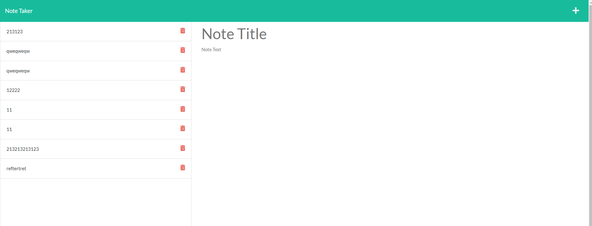

# What I did:
* I installed the proper packages to make this work.
* I made a server.js file to run the server and connect the routes to my local host.
* I made a routes folder which was connected to the server.js and allowed the user to view and use the routes that I made.

## Screenshot of App

## Links
* Click [HERE](https://github.com/KappaMustafa/nta.git) for my repository
* Click [HERE](https://note-taking-app-ma.herokuapp.com/notes) for my deployed heroku app
